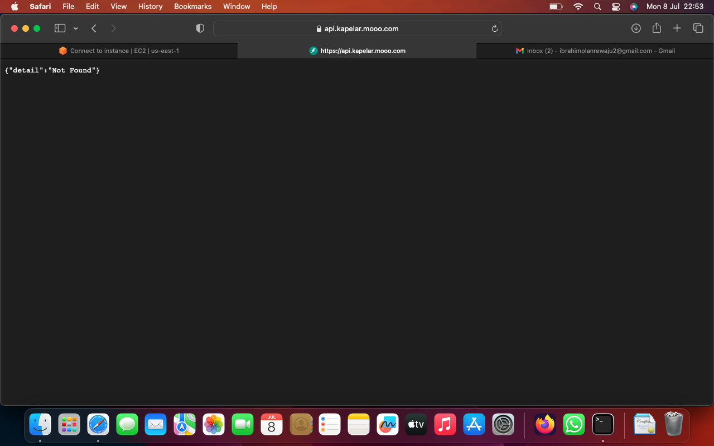

# Dockerization & Deployment Of a Full Stack Web Application

Deployment of a full stack web application (React frontend and FastAPI + PostgreSQL backend) using Docker containers and proxy both services to run on the same port using Traefik 

This repository contains a full-stack web application built with React (frontend), FastAPI (backend), and PostgreSQL (database). The application is containerized using Docker and deployed using Traefik as a reverse proxy.

## Table of Contents

- [Prerequisites](#prerequisites)
- [Local Installation](#local-installation)
  - [Backend](#backend)
  - [Frontend](#frontend)
- [Docker Setup](#docker-setup)
  - [Build Docker Images](#build-docker-images)
  - [Run Docker Containers](#run-docker-containers)
- [Deploy to AWS EC2](#deploy-to-aws-ec2)
- [Accessing the Services](#accessing-the-services)
- [Troubleshooting](#troubleshooting)

## Prerequisites

- Docker and Docker Compose installed
- AWS account
- Domain name (or use a free subdomain from Afraid DNS)

## Local Development

### Backend

1. **Navigate to the backend directory:**
   ```bash
   cd backend

2. **Install dependencies using Poetry:**
   ```sh
    poetry install
    ```
3. **Set up the database with the necessary tables**:
    ```sh
    poetry run bash ./prestart.sh
    ```
4. **Run the backend server**:
    ```sh
    poetry run uvicorn app.main:app --reload
    ```

### Frontend

1. **Navigate to the frontend directory**:
    ```sh
    cd frontend
    ```
2. **Install dependencies**:
    ```sh
    npm install
    ```
3. **Run the development server**:
    ```sh
    npm run dev
    ```

## Docker Setuo

### Build Docker Images

1. **Build the backend image**:
   ```sh
   sudo docker build buildx linux/amd64 -t fastapi-backend .
   ```
2. **Build the frontend image**:
   ```sh
   sudo docker build -t react-frontend ./frontend
   ```

### Run Docker Containers

1. **Create the network**:
   ```sh
   docker network create web
   ```
2. **Start the services**:
   ```sh
   docker-compose up -d
   ```
## Deploy to AWS EC2
1. **Launch an EC2 instance and connect to it.**

2. **Install Docker and Docker Compose on the EC2 instance**:
   ```sh
   sudo apt update
   sudo apt install docker.io
   sudo apt install docker-compose
   ```
3. **Clone your repository and navigate to it**:
   ```sh
   git clone <your-repo-url>
   cd <your-repo-name>
   ```
4. **Create the network**:
   ```sh
   docker network create web
   ```
5. **Start the services**:
   ```sh
   docker-compose up -d
   ```

## Accessing the Services

* [Frontend:](https://kapelar.mooo.com)
  
  
  
  


